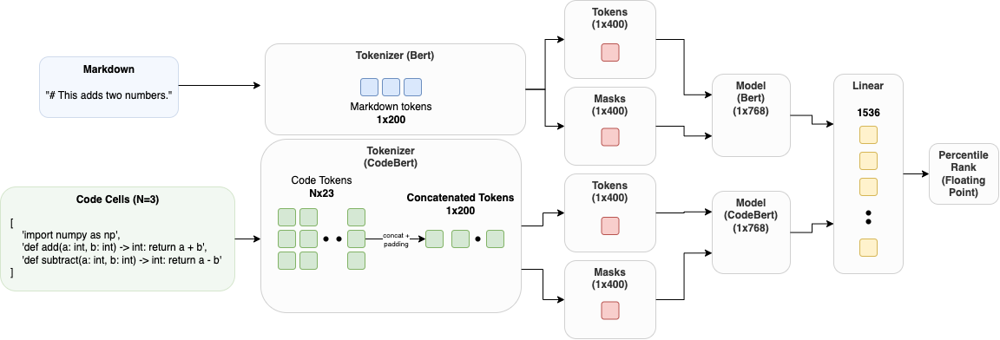
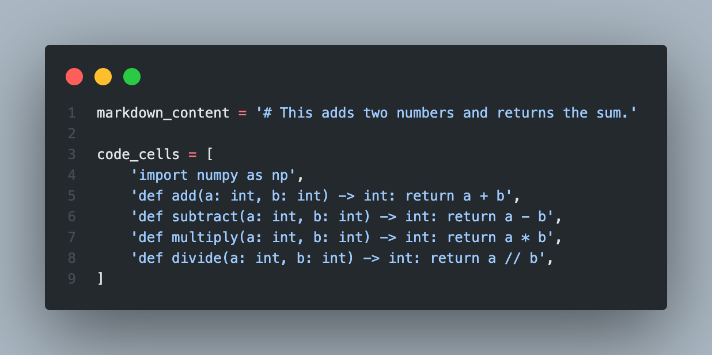

<h1 align="center">
 MIDS W266 Project
</h1>

<h1 align="center">
NotebookNet - An Explorative Machine Learning Approach in Code Comprehension
</h1>


[](https://drive.google.com/drive/folders/1mZILOzPW7pw0siHYzowtgDRLFAMEoKRr)
[](https://wandb.ai/sotoodaa/w266-project)


[](https://pypi.org/project/w266-project/)
[](https://github.com/Naereen/StrapDown.js/blob/master/LICENSE)
## Members
- Qian Qiao
- Sophie Yeh
- Andrew Sotoodeh

## Overview
Research teams across the world are interested in exploring the domain of assistive technology for software engineers. Much like Github Copilot and Amazon CodeWhisperer, understanding natural language and its intrinsic relationship with programming languages could lead to significant improvements in developer productivity and revolutionize the industry standard for writing code.

With the Google AI4Code Kaggle competition, we plan to explore how to predict the correct ordering of the cells in a given Jupyter notebook whose markdown cells have been shuffled. Given an understanding of code cell relationships to markdown comments, it is possible to develop productivity tools that aid in the automatic reconstruction of a notebook's order and readability.





## Usage
```bash
# Clone repo and change directory.
git clone https://github.com/sotoodaa-ucb/ucb_mids_w266_project.git && cd ucb_mids_w266_project

# (Optional) Create virtual environment.
python3 -m venv w266

# Install python requirements.
pip install -r requirements.txt

# Start training.
python w266_project/train.py

# Run test inference.
python w266_project/test.py
```


## Examples



| content                                           |   actual_pct_rank |   predicted_pct_rank |
|:--------------------------------------------------|------------------:|---------------------:|
| import numpy as np                                |          0.166667 |             0.166667 |
| # This adds two numbers and returns the sum.      |          0.333333 |             0.396025 ✅|
| def add(a: int, b: int) -> int: return a + b      |          0.5      |             0.5      |
| def subtract(a: int, b: int) -> int: return a - b |          0.666667 |             0.666667 |
| def multiply(a: int, b: int) -> int: return a * b |          0.833333 |             0.833333 |
| def divide(a: int, b: int) -> int: return a // b  |          1        |             1        |

# Troubleshooting
There are known issues with installing dependencies on M1 Mac.
```
# Problem
error: can't find Rust compiler

# Solution
RUN curl --proto '=https' --tlsv1.2 -sSf https://sh.rustup.rs | sh -s -- -y
ENV PATH="/root/.cargo/bin:${PATH}"
```

```
# Problem
ExecutableNotFound: failed to execute PosixPath('dot'), make sure the Graphviz executables are on your systems' PATH

# Solution
brew install graphviz
```