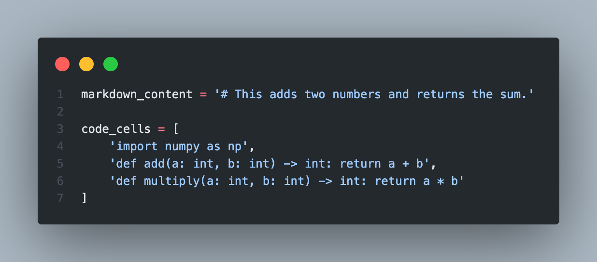

<h1 align="center">
 MIDS W266 Project
</h1>

<h1 align="center">
NotebookNet - An Explorative Machine Learning Approach in Code Comprehension
</h1>


## Members
- Qian Qiao
- Sophie Yeh
- Andrew Sotoodeh

## Overview
Install requirements:
```
pip install -r requirements.txt
```


## Usage
```
# Start training.
python w266_project train.py

# Run test inference.
python w266_project test.py
```


## Examples



| Content                                           |   Actual Percentile Rank|   Predicted Percentile Rank |
|:--------------------------------------------------|------------------:|---------------------:|
| import numpy as np                                |              0.25 |             0.25     |
| **# This adds two numbers and returns the sum.**      |              **0.5**  |             **0.445386** ✅|
| def add(a: int, b: int) -> int: return a + b      |              0.75 |             0.75     |
| def multiply(a: int, b: int) -> int: return a * b |              1    |             1        |


# Troubleshooting
There are known issues with installing dependencies on M1 Mac.
```
# Problem
error: can't find Rust compiler

# Solution
RUN curl --proto '=https' --tlsv1.2 -sSf https://sh.rustup.rs | sh -s -- -y
ENV PATH="/root/.cargo/bin:${PATH}"
```